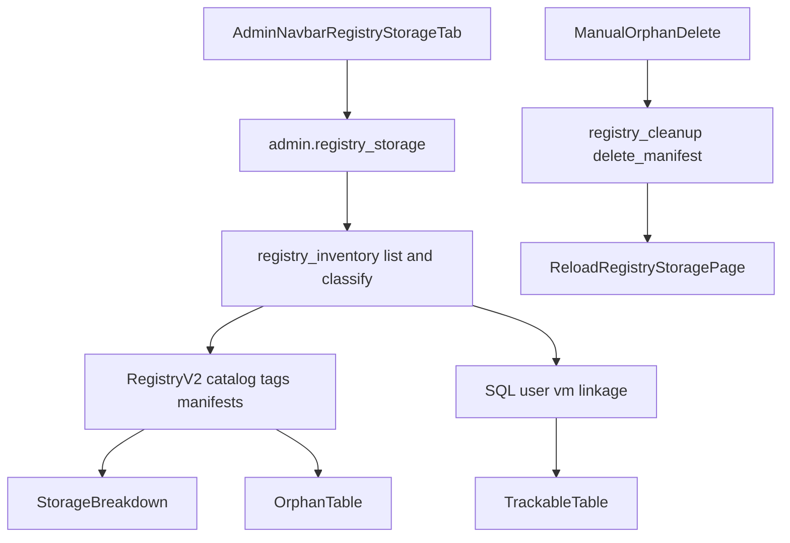

# 8. Admin Registry Storege UI

> **Status**: Implemented (initial version)  
> **Goal**: Provide an admin-only Registry Storage page that separates expected (trackable) registry data from orphaned data and allows manual orphan cleanup.

---

## Functional Requirements

Add a new admin tab in top navigation:

- `Registry Storage` (placed near `Nodes`)

When opened, page shows:

1. **Top storage bar** (Disk Utility style):
   - Total storage size
   - Used by trackable items
   - Used by untrackable/orphaned items
   - Free size

2. **Upper section (trackable / expected)**
   - Registry artefacts that can be linked to SQL VM records
   - Includes states relevant to archived/failed/saving/pulling/migration lifecycle context
   - Per row: user, VM name, SQL status, registry tag, digest, size, cleanup state

3. **Lower section (orphaned / untrackable)**
   - Registry artefacts that do not link to any SQL VM by user+vm path
   - Includes orphaned migration leftovers by the same rule (not linked to active/failed migration context)
   - Per row: registry tag, digest, size, orphan reason, `Delete` button

4. **Manual delete only**
   - No auto-delete in this feature
   - Admin can delete orphaned artefacts one by one

---

## Trackability Rule

An artefact is **trackable** when repository path maps to an existing SQL VM using sanitized `user + vm` matching:

- namespace = sanitized `User.username`
- image name = sanitized `VM.name`

If no SQL VM matches, artefact is **orphaned**.

---

## Storage Math

Configured total capacity:

- `REGISTRY_STORAGE_TOTAL_GB` from config/env (default: `600`)

Used calculations:

- `trackable_used_gb = sum(trackable item sizes)`
- `orphaned_used_gb = sum(orphaned item sizes)`
- `used_gb = trackable_used_gb + orphaned_used_gb`
- `free_gb = max(total_gb - used_gb, 0)`

---

## Architecture

---

## Implemented Files

- `app/templates/base.html`
  - Added admin nav tab `Registry Storage`
- `app/admin/routes.py`
  - Added `GET /admin/registry-storage`
  - Added `POST /admin/registry-storage/orphans/delete`
- `app/registry_inventory.py` (new)
  - Registry catalog/tag/manifest inventory
  - Per-item size extraction
  - SQL linkage classification (trackable vs orphaned)
  - Storage breakdown aggregation
- `app/templates/admin/registry_storage.html` (new)
  - Top bar + summary
  - Trackable table
  - Orphaned table + per-row delete action
- `config.py`
  - Added `REGISTRY_STORAGE_TOTAL_GB`

---

## Notes and Limitations

- Size is estimated from manifest payload sizes (`config + layers/manifests`).
- If digest is unavailable for an orphan item, row cannot be deleted from UI (digest required).
- This version focuses on manual operations and observability; no background orphan sweeps.

---

## Validation Checklist

- [x] Admin sees `Registry Storage` tab in top nav.
- [x] Page loads with top storage bar and summary metrics.
- [x] Trackable rows show user/vm/status/tag/digest/size.
- [x] Orphaned rows show reason and per-row delete button.
- [x] Delete action removes orphaned manifest by digest and returns to page.
- [x] Uses configured storage capacity (`REGISTRY_STORAGE_TOTAL_GB`) for bar math.

