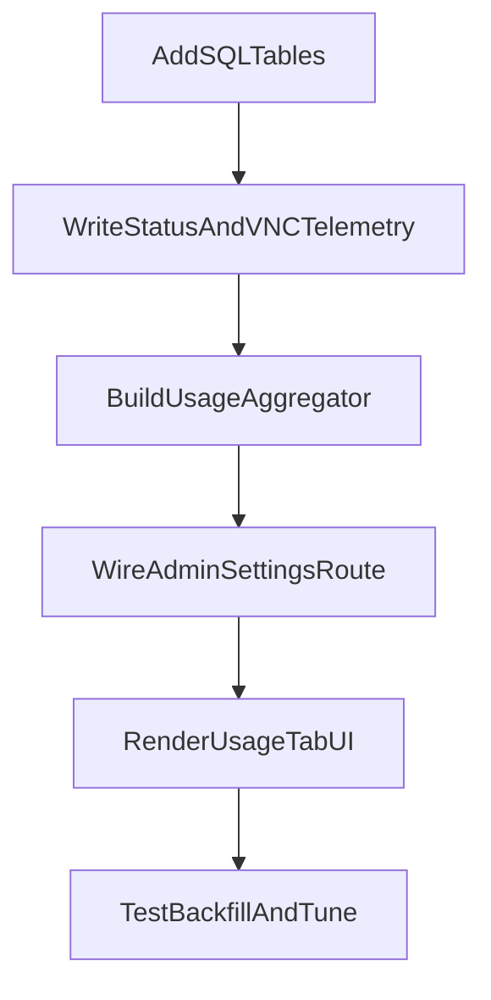

# Admin Usage Tab: VM + VNC Time Metrics

## Implementation Progress

- [x] Module 1: Add schema tables and shared usage-event helpers.
- [x] Module 2: Instrument VM status and VNC lifecycle writes.
- [x] Module 3: Build usage aggregation service + admin Usage tab UI.
- [x] Module 4: Validation pass, lint/test checks, and final polish.

## [x] Goals

- Add an Admin UI tab named **Usage** to monitor VM time usage and detect long-running VM/VNC behavior.
- Include only VMs that are currently on nodes (`running` or `stopped`; exclude archived/off-node VMs).
- Display an Apple-style segmented lifetime bar per VM (baseline confirmed: **since VM `created_at`**):
  - `stopped` = grey
  - `running` (no VNC) = red
  - `running` + active VNC websocket = green

## [x] Existing Code To Reuse

- Admin settings route + template: [app/admin/routes.py](app/admin/routes.py), [app/templates/admin/settings.html](app/templates/admin/settings.html)
- Existing segmented storage bar pattern: [app/templates/admin/registry_storage.html](app/templates/admin/registry_storage.html)
- VM lifecycle mutations: [app/main/routes.py](app/main/routes.py), [app/api/routes.py](app/api/routes.py)
- Console websocket lifecycle hooks: [app/console/routes.py](app/console/routes.py)
- ORM models: [app/models.py](app/models.py)

## [x] Data Model (2 New SQL Tables)

### [x] 1) `vm_status_events`

Purpose: immutable VM state transitions used to compute running/stopped durations.

Proposed columns:

- `id` (PK)
- `vm_id` (FK -> `vms.id`, indexed, not null)
- `user_id` (FK -> `users.id`, indexed, not null)
- `node_id` (FK -> `nodes.id`, nullable; null when unknown/off-node)
- `from_status` (`String(32)`, nullable)
- `to_status` (`String(32)`, not null)
- `changed_at` (`DateTime`, default utcnow, indexed, not null)
- `source` (`String(32)`, not null) e.g. `ui`, `api_poller`, `system`
- `context` (`String(128)`, nullable) e.g. `start_vm`, `stop_vm`, `restore_done`

Indexes:

- `(vm_id, changed_at)`
- `(user_id, changed_at)`
- optional `(to_status, changed_at)` for reporting

### [x] 2) `vm_vnc_sessions`

Purpose: durable VNC connected intervals (confirmed definition: full websocket connected duration).

Proposed columns:

- `id` (PK)
- `vm_id` (FK -> `vms.id`, indexed, not null)
- `user_id` (FK -> `users.id`, indexed, not null)
- `node_id` (FK -> `nodes.id`, nullable)
- `connected_at` (`DateTime`, default utcnow, indexed, not null)
- `disconnected_at` (`DateTime`, nullable until closed)
- `disconnect_reason` (`String(64)`, nullable)
- `session_token` (`String(64)`, unique, indexed, not null) for correlating open/close

Indexes:

- `(vm_id, connected_at)`
- `(user_id, connected_at)`
- partial/open-session lookup via `session_token`

## [x] Event Capture Plan

### [x] VM status event writes

- Add helper in [app/main/routes.py](app/main/routes.py) and [app/api/routes.py](app/api/routes.py): `record_vm_status_transition(vm, from_status, to_status, source, context)`.
- Call helper immediately after successful transitions already present in code paths:
  - create (`creating`)
  - start (`stopped -> running`)
  - stop (`running -> stopped`)
  - save/archive (`running/stopped -> pushing -> archived`)
  - resume/restore (`archived -> pulling -> running`)
  - failure transitions (`* -> failed` where applicable)
- Seed initial event for existing VMs during backfill (one-time script/command).

### [x] VNC session writes

- In [app/console/routes.py](app/console/routes.py), create a session row when websocket bridge opens and finalize it on disconnect in `finally` block.
- Generate `session_token` at open; persist in request-local context to close the same row reliably.
- On unclean disconnect/server restart edge cases, leave open row and treat as open-until-now in aggregation (with optional stale-session cleanup later).

## [x] Aggregation Logic (Server-Side)

- Add admin usage aggregation service (new module, e.g. `app/admin/usage_metrics.py`).
- For each non-archived VM (`status in ('running','stopped')`, `node_id is not null`):
  1. Build VM state intervals from `vm_status_events` since `created_at`.
  2. Compute `stopped_seconds` and `running_total_seconds`.
  3. Intersect `running` intervals with `vm_vnc_sessions` intervals to compute `running_vnc_seconds`.
  4. Derive `running_no_vnc_seconds = max(running_total_seconds - running_vnc_seconds, 0)`.
  5. `lifetime_seconds = now - created_at`; sanity clamp all segments to `[0, lifetime_seconds]` and normalize tiny rounding drift.
- Include per-user rollups by summing VM segment durations.

## [x] Admin UI Plan

- Extend [app/templates/admin/settings.html](app/templates/admin/settings.html) to include Bootstrap tabs:
  - existing SMTP tab
  - new **Usage** tab
- Reuse segmented progress bar structure from [app/templates/admin/registry_storage.html](app/templates/admin/registry_storage.html) with new color mapping:
  - grey (`bg-secondary`) = stopped
  - red (`bg-danger`) = running/no VNC
  - green (`bg-success`) = running/VNC
- In Usage tab:
  - Group by user
  - Show VM table/cards with:
    - VM name, status, node
    - total lifetime + segment durations (human readable)
    - segmented bar (% of lifetime)
  - Add warning badge/threshold indicators for long-running active VM and long-running VNC sessions.

## [x] Route + Template Data Contract

- Update [app/admin/routes.py](app/admin/routes.py) `settings()` to fetch usage metrics and pass:
  - `usage_by_user`
  - `usage_generated_at`
  - optional thresholds config
- Keep rendering server-side via Jinja initially (no new frontend framework dependency).

## [x] Reliability, Backfill, and Performance

- Backfill command (or startup-safe routine) to initialize minimum baseline events for existing VMs lacking history.
- Guardrails:
  - de-duplicate duplicate consecutive status events (`to_status` same as latest)
  - idempotent close of VNC session rows
- Performance:
  - query only active/stopped VM IDs first
  - batch-load related events/sessions by VM set
  - compute in Python for first version; optimize with SQL window functions only if needed.

## [x] Validation & Tests

- Unit tests for interval math:
  - pure stopped VM
  - running with no VNC
  - overlapping/multiple VNC sessions
  - open VNC session still connected
  - missing/partial status history fallback
- Route/template tests for admin settings Usage tab rendering and grouping.
- Manual verification scenarios:
  - start/stop VM cycles
  - open/close VNC repeatedly
  - resume from archived then run VNC

## [x] Delivery Sequence

## Cross-Feature Note (Direct TCP `.vncloc`)

- Usage metrics in this plan track browser websocket VNC sessions (`vm_vnc_sessions`).
- Native `.vncloc` direct TCP sessions are currently not part of usage-session aggregation.
- If native session accounting is required later, extend usage-event capture for `DirectTcpProxyManager` connect/disconnect intervals.

## Implementation Reality Notes

- Final UI route is `GET /admin/usage` with navbar entry, not an embedded tab under settings.
- Aggregation scope is local, node-backed VMs only: `status in ('running','stopped')` and `node_id is not null`.
- Warning thresholds are currently fixed in code:
  - running without VNC: `8h`
  - running with active websocket VNC: `4h`
