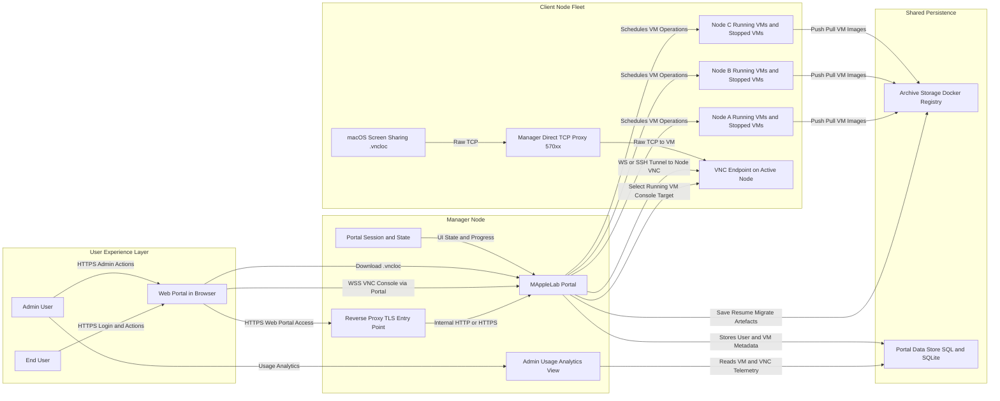

# Diagram 1 - Environment Architecture and User Experience

Use this in product overviews to explain the end-to-end experience from browser to VM console and archived VM storage.

```mermaid
flowchart LR
    subgraph userSide [User Experience Layer]
        EndUser[End User]
        AdminUser[Admin User]
        BrowserPortal[Web Portal in Browser]
    end

    subgraph managerZone [Manager Node]
        ReverseProxy[Reverse Proxy TLS Entry Point]
        PortalApp[MAppleLab Portal]
        SessionStore[Portal Session and State]
        UsageView[Admin Usage Analytics View]
    end

    subgraph nodeFleet [Client Node Fleet]
        NodeA[Node A Running VMs and Stopped VMs]
        NodeB[Node B Running VMs and Stopped VMs]
        NodeC[Node C Running VMs and Stopped VMs]
        NodeVNC[VNC Endpoint on Active Node]
        NativeClient[macOS Screen Sharing .vncloc]
        DirectProxy[Manager Direct TCP Proxy 570xx]
    end

    subgraph persistenceZone [Shared Persistence]
        ArchiveStore[Archive Storage Docker Registry]
        PortalDB[Portal Data Store SQL and SQLite]
    end

    EndUser -->|HTTPS Login and Actions| BrowserPortal
    AdminUser -->|HTTPS Admin Actions| BrowserPortal
    BrowserPortal -->|HTTPS Web Portal Access| ReverseProxy
    ReverseProxy -->|Internal HTTP or HTTPS| PortalApp
    AdminUser -->|Usage Analytics| UsageView
    UsageView -->|Reads VM and VNC Telemetry| PortalDB
    PortalApp -->|Stores User and VM Metadata| PortalDB
    PortalApp -->|Schedules VM Operations| NodeA
    PortalApp -->|Schedules VM Operations| NodeB
    PortalApp -->|Schedules VM Operations| NodeC
    PortalApp -->|Save Resume Migrate Artefacts| ArchiveStore

    NodeA -->|Push Pull VM Images| ArchiveStore
    NodeB -->|Push Pull VM Images| ArchiveStore
    NodeC -->|Push Pull VM Images| ArchiveStore

    PortalApp -->|Select Running VM Console Target| NodeVNC
    BrowserPortal -->|WSS VNC Console via Portal| PortalApp
    PortalApp -->|WS or SSH Tunnel to Node VNC| NodeVNC
    BrowserPortal -->|Download .vncloc| PortalApp
    NativeClient -->|Raw TCP| DirectProxy
    DirectProxy -->|Raw TCP to VM| NodeVNC
    SessionStore -->|UI State and Progress| PortalApp
```
