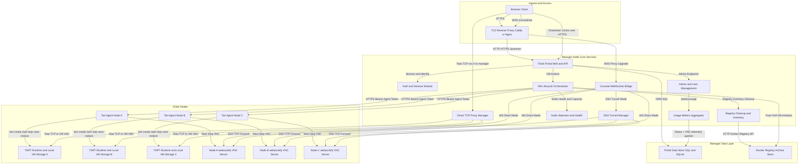

# Diagram 2 - Technical Architecture Modules and Communication Channels

Use this in technical deep dives to show modules, data stores, and protocol-level channels.

```mermaid
flowchart TB
    subgraph ingress [Ingress and Access]
        UserBrowser[Browser Client]
        TLSProxy[TLS Reverse Proxy Caddy or Nginx]
    end

    subgraph managerCore [Manager Node Core Services]
        PortalWeb[Flask Portal Web and API]
        AuthModule[Auth and Session Module]
        AdminModule[Admin and User Management]
        VMOrchestrator[VM Lifecycle Orchestrator]
        ConsoleBridge[Console WebSocket Bridge]
        TunnelModule[SSH Tunnel Manager]
        DirectTcpProxy[Direct TCP Proxy Manager]
        UsageMetrics[Usage Metrics Aggregator]
        NodeManager[Node Selection and Health]
        CleanupModule[Registry Cleanup and Inventory]
    end

    subgraph managerData [Manager Data Layer]
        SQLStore[Portal Data Store SQL and SQLite]
        RegistryStore[Docker Registry Archive Store]
    end

    subgraph nodeLayer [Client Nodes]
        NodeAgentA[Tart Agent Node A]
        NodeAgentB[Tart Agent Node B]
        NodeAgentC[Tart Agent Node C]
        LocalTartA[TART Runtime and Local VM Storage A]
        LocalTartB[TART Runtime and Local VM Storage B]
        LocalTartC[TART Runtime and Local VM Storage C]
        NodeVncA[Node A websockify VNC Server]
        NodeVncB[Node B websockify VNC Server]
        NodeVncC[Node C websockify VNC Server]
    end

    UserBrowser -->|HTTPS| TLSProxy
    TLSProxy -->|HTTP HTTPS Upstream| PortalWeb
    UserBrowser -->|WSS /console/ws| TLSProxy
    TLSProxy -->|WSS Proxy Upgrade| ConsoleBridge

    PortalWeb -->|Session and Identity| AuthModule
    PortalWeb -->|Admin Endpoints| AdminModule
    AdminModule -->|/admin/usage| UsageMetrics
    PortalWeb -->|VM Actions| VMOrchestrator
    VMOrchestrator -->|Node Health and Capacity| NodeManager
    VMOrchestrator -->|Registry Inventory Cleanup| CleanupModule

    PortalWeb -->|ORM SQL| SQLStore
    UsageMetrics -->|Status + VNC telemetry queries| SQLStore
    CleanupModule -->|HTTP Docker Registry API| RegistryStore
    VMOrchestrator -->|Push Pull VM Artefacts| RegistryStore

    VMOrchestrator -->|HTTPS Bearer Agent Token| NodeAgentA
    VMOrchestrator -->|HTTPS Bearer Agent Token| NodeAgentB
    VMOrchestrator -->|HTTPS Bearer Agent Token| NodeAgentC

    NodeAgentA -->|tart create start stop save restore| LocalTartA
    NodeAgentB -->|tart create start stop save restore| LocalTartB
    NodeAgentC -->|tart create start stop save restore| LocalTartC

    NodeAgentA -->|Start Stop VNC| NodeVncA
    NodeAgentB -->|Start Stop VNC| NodeVncB
    NodeAgentC -->|Start Stop VNC| NodeVncC

    ConsoleBridge -->|WS Direct Mode| NodeVncA
    ConsoleBridge -->|WS Direct Mode| NodeVncB
    ConsoleBridge -->|WS Direct Mode| NodeVncC

    ConsoleBridge -->|SSH Tunnel Mode| TunnelModule
    TunnelModule -->|SSH TCP Forward| NodeVncA
    TunnelModule -->|SSH TCP Forward| NodeVncB
    TunnelModule -->|SSH TCP Forward| NodeVncC

    UserBrowser -->|Download .vncloc over HTTPS| PortalWeb
    UserBrowser -->|Raw TCP vnc:// to manager| DirectTcpProxy
    DirectTcpProxy -->|Raw TCP to VM VNC| LocalTartA
    DirectTcpProxy -->|Raw TCP to VM VNC| LocalTartB
    DirectTcpProxy -->|Raw TCP to VM VNC| LocalTartC
```
