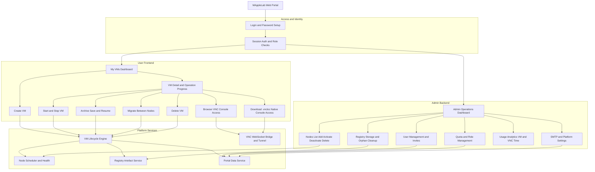

# Diagram 3 - Portal Structure Components and Functions

Use this in feature demos to explain what users and admins do inside the portal.

```mermaid
flowchart TB
    PortalRoot[MAppleLab Web Portal]

    subgraph accessLayer [Access and Identity]
        LoginPage[Login and Password Setup]
        SessionAuth[Session Auth and Role Checks]
    end

    subgraph userFrontend [User Frontend]
        MyVmsPage[My VMs Dashboard]
        VmDetailPage[VM Detail and Operation Progress]
        CreateVmFlow[Create VM]
        StartStopFlow[Start and Stop VM]
        ArchiveResumeFlow[Archive Save and Resume]
        MigrateFlow[Migrate Between Nodes]
        DeleteFlow[Delete VM]
        VncBrowserFlow[Browser VNC Console Access]
        VncNativeFlow[Download .vncloc Native Console Access]
    end

    subgraph adminBackend [Admin Backend]
        AdminDashboard[Admin Operations Dashboard]
        UsersMgmt[User Management and Invites]
        QuotaMgmt[Quota and Role Management]
        NodesMgmt[Nodes List Add Activate Deactivate Delete]
        RegistryPage[Registry Storage and Orphan Cleanup]
        UsagePage[Usage Analytics VM and VNC Time]
        SettingsPage[SMTP and Platform Settings]
    end

    subgraph platformServices [Platform Services]
        VmEngine[VM Lifecycle Engine]
        NodeScheduler[Node Scheduler and Health]
        RegistryService[Registry Artefact Service]
        ConsoleService[VNC WebSocket Bridge and Tunnel]
        DataService[Portal Data Service]
    end

    PortalRoot --> LoginPage
    LoginPage --> SessionAuth
    SessionAuth --> MyVmsPage
    SessionAuth --> AdminDashboard

    MyVmsPage --> VmDetailPage
    MyVmsPage --> CreateVmFlow
    VmDetailPage --> StartStopFlow
    VmDetailPage --> ArchiveResumeFlow
    VmDetailPage --> MigrateFlow
    VmDetailPage --> DeleteFlow
    VmDetailPage --> VncBrowserFlow
    VmDetailPage --> VncNativeFlow

    AdminDashboard --> UsersMgmt
    AdminDashboard --> QuotaMgmt
    AdminDashboard --> NodesMgmt
    AdminDashboard --> RegistryPage
    AdminDashboard --> UsagePage
    AdminDashboard --> SettingsPage

    CreateVmFlow --> VmEngine
    StartStopFlow --> VmEngine
    ArchiveResumeFlow --> VmEngine
    MigrateFlow --> VmEngine
    DeleteFlow --> VmEngine
    VncBrowserFlow --> ConsoleService
    VncNativeFlow --> ConsoleService

    VmEngine --> NodeScheduler
    VmEngine --> RegistryService
    VmEngine --> DataService
    RegistryPage --> RegistryService
    NodesMgmt --> NodeScheduler
    UsersMgmt --> DataService
    QuotaMgmt --> DataService
    SettingsPage --> DataService
```
