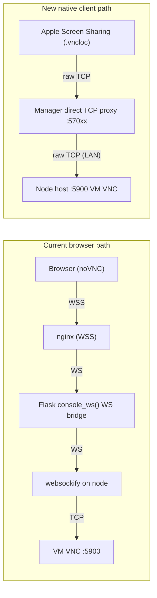

# Direct TCP `.vncloc` Download Plan

## Goal

Provide a downloadable, preconfigured macOS VNC launch file (`.vncloc`) for running VMs, using a direct TCP path that bypasses Flask/WebSocket relay overhead.

## Performance Answer

Traffic in this approach does **not** pass through the slower Flask WebSocket path.  
It uses a lightweight socket bridge loop (`select` + `recv` + `sendall`) and does not parse WebSocket frames or traverse WSGI request handling for session data.

## Architecture



## Detailed Implementation

### 1) Add new proxy manager

- New file: `app/direct_tcp_proxy.py`
- Create `DirectTcpProxyManager` with:
  - Port allocation in a dedicated range
  - `start_proxy(vm_name, target_host, target_port) -> local_port`
  - `stop_proxy(vm_name)`
  - `get_proxy_port(vm_name)`
  - `cleanup_all()`
- Bridge implementation uses plain socket forwarding (`select` / `recv` / `sendall`), no protocol transformation.

### 2) Add config for direct proxy port range

- File: `config.py`
- Add:
  - `VNC_DIRECT_PORT_MIN` (default `57000`)
  - `VNC_DIRECT_PORT_MAX` (default `57099`)

### 3) Wire manager into app lifecycle

- File: `app/__init__.py`
- Initialize in `create_app()`:
  - `app.direct_tcp_proxy = DirectTcpProxyManager(app)`
- Register shutdown cleanup:
  - `atexit.register(app.direct_tcp_proxy.cleanup_all)`

### 4) Extend VNC start response usage

- File: `app/tart_client.py`
- Update `start_vnc()` to return tuple:
  - `(ws_port, vnc_port)`
  - fallback `vnc_port` to `5900` if missing

Agent-side (separate repo) should eventually return:

```json
{ "port": 6901, "vnc_port": 5900 }
```

### 5) Add download endpoint

- File: `app/console/routes.py`
- New route:
  - `GET /console/<vm_name>/vncloc`
- Route flow:
  1. Auth + VM ownership check
  2. Ensure VM is running and node exists
  3. Start/resolve VNC port from agent
  4. Allocate proxy port via `app.direct_tcp_proxy.start_proxy(...)`
  5. Build `.vncloc` XML with manager public host + allocated port
  6. Return as attachment (`<vm_name>.vncloc`)

### 6) Add UI entry point

- File: `app/templates/main/vm_detail.html`
- Add `Download .vncloc` button next to `Open Console` for running VMs.

## Lifecycle and Cleanup

- Proxy created on file download (or first direct session request)
- Proxy closed on:
  - explicit console disconnect flow
  - VM stop/archive/delete paths
  - app shutdown hook

## Networking Requirements

- Port range `57000-57099` must be reachable from users to manager host.
- This is raw TCP (not HTTP), so standard HTTP reverse proxy blocks are not enough.

Options:
- Open manager firewall for this range directly, or
- Configure nginx `stream {}` passthrough for same range.

## Security Notes

- Do not embed VNC password in `.vncloc`; allow client prompt at connect time.
- Keep proxy mapping session-scoped and reclaim stale ports with timeout/cleanup.
- Keep ownership checks strict (`@login_required` + VM owner validation).

## Affected Files Summary

- `app/direct_tcp_proxy.py` (new)
- `config.py`
- `app/__init__.py`
- `app/tart_client.py`
- `app/console/routes.py`
- `app/templates/main/vm_detail.html`
- tart_agent repo: `/vnc/<name>/start` response enhancement (`vnc_port`)

---

## Part 2: Step-by-Step Rollout Checklist

### Phase A — Development Implementation

- [x] Create `app/direct_tcp_proxy.py` with:
  - [x] port allocation in configured range
  - [x] `start_proxy`, `stop_proxy`, `get_proxy_port`, `cleanup_all`
  - [x] socket bridge loop (`select`/`recv`/`sendall`)
- [x] Add `VNC_DIRECT_PORT_MIN` and `VNC_DIRECT_PORT_MAX` to `config.py`.
- [x] Initialize `app.direct_tcp_proxy` and `atexit` cleanup in `app/__init__.py`.
- [ ] Update `app/tart_client.py` `start_vnc()` return shape to `(ws_port, vnc_port)` with fallback `5900`.
- [ ] Add route `GET /console/<vm_name>/vncloc` in `app/console/routes.py`.
- [ ] Add UI button in `app/templates/main/vm_detail.html`.
- [ ] Ensure existing browser console flow still works unchanged.

### Phase B — Local Functional Verification

- [ ] Start manager locally with new code.
- [ ] Run/create a VM in `running` state.
- [ ] Open VM detail page and confirm `Download .vncloc` button appears only for running VM.
- [ ] Download file and verify:
  - [ ] extension is `.vncloc`
  - [ ] contents contain manager host + allocated direct proxy port
  - [ ] no password embedded in URL or file
- [ ] Double-click on macOS and confirm Screen Sharing opens target.
- [ ] Confirm VNC credential prompt appears client-side.
- [ ] Validate data path performance qualitatively against browser noVNC.

### Phase C — Negative and Security Tests

- [ ] Access `/console/<vm_name>/vncloc` while logged out: should be denied/redirected.
- [ ] Access another user's VM by name: must return 404/deny.
- [ ] Try with VM not running: route should redirect with warning.
- [ ] Confirm stale proxy mappings are cleaned when VM is stopped/deleted/disconnected.
- [ ] Confirm no credentials are written into logs during file generation.

### Phase D — tart_agent Compatibility Update (Separate Repo)

- [ ] Update agent `/vnc/<name>/start` response to include `vnc_port`.
- [ ] Deploy to one test node first.
- [ ] Verify manager fallback to `5900` still works if node is old version.
- [ ] Verify mixed fleet behavior (some updated nodes, some legacy nodes).

### Phase E — Staging Networking Setup

- [ ] Choose one exposure method:
  - [ ] direct firewall exposure of `57000-57099`, or
  - [ ] nginx `stream` passthrough for `57000-57099`
- [ ] Confirm external reachability from test client to manager on selected range.
- [ ] Confirm ports are not broadly open beyond intended CIDRs (if restricting source IP ranges).
- [ ] Validate TLS/offloading expectations for chosen path.

### Phase F — Staging End-to-End Test Matrix

- [ ] 1 concurrent user / 1 VM direct connection.
- [ ] 5 concurrent users / different VMs.
- [ ] repeated connect/disconnect loop (20+ cycles) to detect leaked ports.
- [ ] manager restart during active direct sessions (validate cleanup behavior).
- [ ] node restart while proxy exists (validate graceful failure and user feedback).
- [ ] compare browser noVNC still healthy under same staging build.

### Phase G — Observability Before Production

- [ ] Add/confirm logs for:
  - [ ] proxy allocation (vm, node, local_port)
  - [ ] proxy close reason (disconnect, vm_stop, ttl, shutdown, error)
  - [ ] bridge errors and connect failures
- [ ] Add lightweight counters (if available):
  - [ ] active direct proxies
  - [ ] allocation failures (port exhaustion)
  - [ ] average session duration
- [ ] Define alert thresholds for repeated allocation or bridge errors.

### Phase H — Production Rollout Strategy

- [ ] Deploy manager code with feature disabled by default (optional flag recommended).
- [ ] Enable feature for admin users only first (or one pilot user group).
- [ ] Monitor for 24-48h:
  - [ ] connection success rate
  - [ ] support tickets/user-reported failures
  - [ ] CPU/network impact on manager host
- [ ] Expand rollout to all users if stable.

### Phase I — Rollback Plan

- [ ] Immediate rollback switch:
  - [ ] hide/remove `.vncloc` button route exposure
  - [ ] keep browser noVNC as primary fallback
- [ ] If severe issue:
  - [ ] revert manager deployment
  - [ ] close direct proxy port range at firewall/nginx
- [ ] Validate browser console unaffected after rollback.

### Phase J — Documentation Updates

- [ ] Add user guide section: how to use `.vncloc` and Screen Sharing.
- [ ] Add admin section: required open ports and network prerequisites.
- [ ] Add troubleshooting section:
  - [ ] connection timeout causes
  - [ ] ownership/authorization failures
  - [ ] node unreachable and port exhaustion scenarios
- [ ] Add security notes: credentials are prompted client-side and not embedded.
